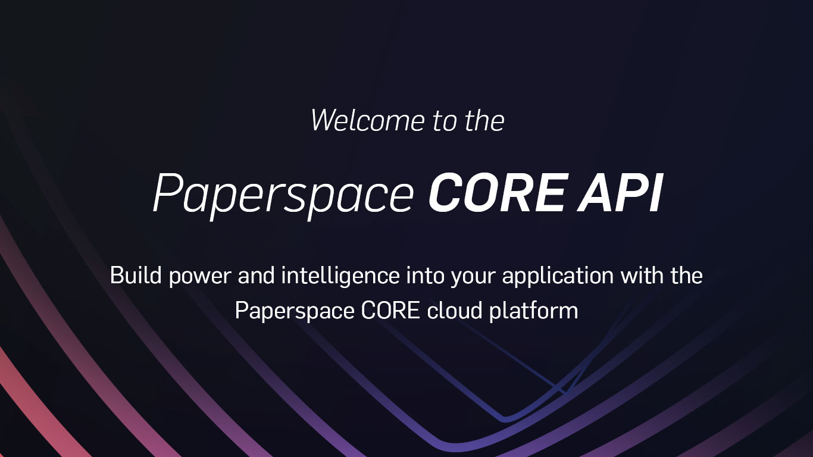

# Introduction


Note: These docs cover the CORE API. To learn how to use CORE from the web console, view the [Help Center](https://support.paperspace.com/hc/en-us). 


Welcome to the **Paperspace CORE API** documentation. CORE provides a RESTful API for programmatically managing your compute resources. It is currently available through the use of standard HTTP requests as well as a JavaScript client for Node.js. We plan to offer other languages and integrations in the future. 

## Usage 

You can interact with CORE API in two ways: by using an HTTP client of your choice and the Paperspace API HTTP endpoints or programmatically from within a Javascript Node.js application.

#### Other clients

If you've created an API client in a language other than JavaScript, please let us know at [support@paperspace.com](mailto:support@paperspace.com) and we will link to it here.

## Sample Apps 

See the directory [samples](https://github.com/Paperspace/paperspace-node/tree/master/samples) for a few simple samples of using the node API. Note: the [jq](https://stedolan.github.io/jq/) tool is used in the bash sample for parsing JSON data.

## Contributing 

We welcome contributions to this project. Please adhere to the established coding conventions within the project and submit changes using pull requests.

Additional information for developers is here: [developers.md](https://paperspace.github.io/paperspace-node/developers.md)

## Bugs / Support / Troubleshooting 

For bugs with the API client or the HTTP API, please file tickets using GitHub Issues on [this](https://github.com/paperspace/paperspace-node) repo. We'll do our best to respond as quickly as we can. Keep in mind that Paperspace is a small team and you may need to allow up to a week for a response.

Other issues, such as those related to your Paperspace account, your team or team members, billing, or technical issues with your Paperspace machines should be directed to [support@paperspace.com](mailto:support@paperspace.com).

## Security 

Think you've discovered a security flaw or exploit? Please contact us directly at [support@paperspace.com](mailto:support@paperspace.com) and we will respond as quickly as we can.

## Disclaimer 

**Use the CORE API with care.** This tool is provided as-is \(please see our [LICENSE](./#license)\). Know that many actions provided via our public API can result in billing charges for Paperspace services. Please be aware of Paperspace's billing policies before performing any of these actions; you'll see charges reflected in your invoice at the end of the month. Some actions, such as deactivating machines, are irreversible, resulting in permanent loss of data. Paperspace cannot recover lost data such as mistakenly deleted account information, and may only be able to give limited assistance if an action is performed mistakenly. API access will be disabled for accounts not in good standing. Keeping your account credentials secret is your responsibility. You may only use Paperspace's CORE API to store, retrieve, query, serve, and execute content that is owned, licensed or lawfully obtained by you.

## License 

This project is open-source, under the ISC license. 

> Copyright \(c\) 2021, Paperspace support@paperspace.com&gt;
>
> Permission to use, copy, modify, and/or distribute this software for any purpose with or without fee is hereby granted, provided that the above copyright notice and this permission notice appear in all copies.
>
> THE SOFTWARE IS PROVIDED "AS IS" AND THE AUTHOR DISCLAIMS ALL WARRANTIES WITH REGARD TO THIS SOFTWARE INCLUDING ALL IMPLIED WARRANTIES OF MERCHANTABILITY AND FITNESS. IN NO EVENT SHALL THE AUTHOR BE LIABLE FOR ANY SPECIAL, DIRECT, INDIRECT, OR CONSEQUENTIAL DAMAGES OR ANY DAMAGES WHATSOEVER RESULTING FROM LOSS OF USE, DATA OR PROFITS, WHETHER IN AN ACTION OF CONTRACT, NEGLIGENCE OR OTHER TORTIOUS ACTION, ARISING OUT OF OR IN CONNECTION WITH THE USE OR PERFORMANCE OF THIS SOFTWARE.

## Copyright 

Copyright 2021 Paperspace Co. - All Rights Reserved

