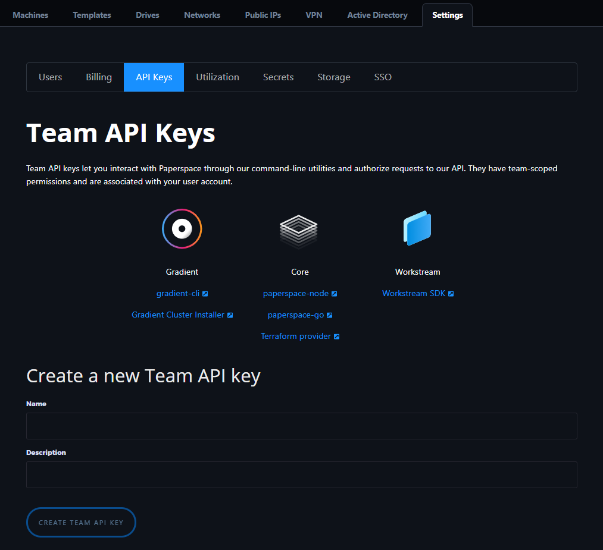

# Obtaining an API Key

### Setup a Paperspace Account 

Before you can use this tool, you'll need a [Paperspace account](https://paperspace.com/). You'll use this account to obtain a Paperspace CORE API key. After creating your Paperspace account check your email to confirm your account before logging in.

### Obtaining an API key 

Once you have created a Paperspace Account you will need to obtain an API key. There is currently only one way to create an API key: from within the API section of your Paperspace console. Your API key allows you to access the Paperspace CORE APIs as well as other Paperspace products such as [Gradient](https://gradient.paperspace.com), an MLOps platform. 

#### Creating an API key via your Paperspace Console 

You can create an API key from within your Paperspace console under the [API](https://www.paperspace.com/console/account/api) section. Login to your [Paperspace console](https://www.paperspace.com/console), visit your team settings page, locate the API section, and follow the instructions to create a new API key.


**Note:** You can copy actual the API key value associated with the API token name only at the time of initial creation. 


You'll use the API keys to authenticate your requests.

###  

